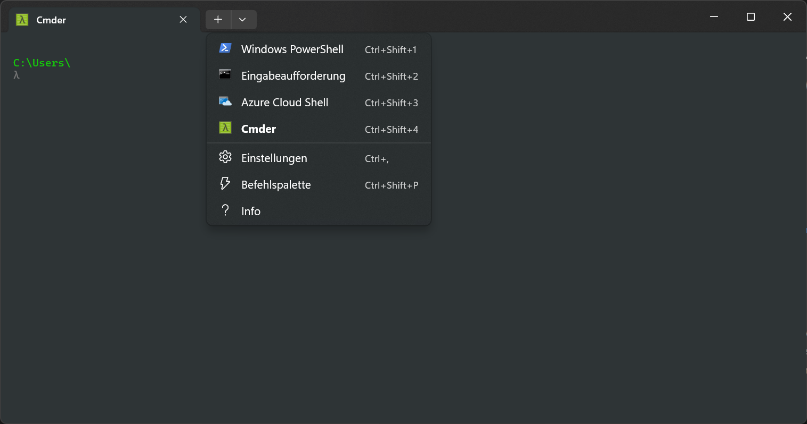

# Cmder Terminal Setup Script

This Python script sets up **Cmder** as the default profile in Windows Terminal, enhancing your terminal experience with features such as auto-completion, persistent history, and a customizable environment. 

The script is designed for **Windows 11** and is tested to work with the **portable version of Cmder**.

---

## Features
- Automatically sets up environment variables required for Cmder.
- Adds a new profile for Cmder in Windows Terminal.
- Backs up your current `settings.json` file from Windows Terminal for safety.
- Sets Cmder as the default terminal profile.

---

## Prerequisites
1. **Python 3.x** must be installed and added to your system PATH.
2. **Cmder Portable Version**: Download and extract the portable version of Cmder from [https://cmder.app/](https://cmder.app/).
3. Place the script in the same directory where the portable `Cmder.exe` resides.

---

## Usage Instructions

### 1. Prepare Your Environment
1. Extract the portable Cmder to a directory of your choice (e.g., `C:\Cmder`).
2. Copy this script into the same directory as `Cmder.exe`.

### 2. Run the Script
- Open a terminal (Command Prompt or PowerShell).
- Navigate to the folder containing the script and `Cmder.exe`.
- Execute the script using:
  ```bash
  python setup_cmder_terminal.py
  ```

### 3. Confirmation
The script will:
1. Set up environment variables `ConEmuDir` and `CMDER_ROOT`.
2. Add a Cmder profile to Windows Terminal with the following settings:
    - **Command Line**: `cmd.exe /k %CMDER_ROOT%\vendor\init.bat`
    - **Icon**: `%CMDER_ROOT%\icons\cmder.ico`
    - **Font**: Cascadia Code, size 10.
    - **Background**: `#2e3436`
3. Back up your existing `settings.json` file to the same directory as the script (`settings.json.bak`).

---

## Reverting Changes
If you wish to undo the changes:
1. Restore the original `settings.json` file in Windows Terminal:
    - Navigate to the folder where the script resides.
    - Locate the backup file (`settings.json.bak`).
    - Copy and replace it to:
      ```
      %LOCALAPPDATA%\Packages\Microsoft.WindowsTerminal_<random_string>\LocalState\
      ```
2. Reset Environment Variables:
    - Open a terminal (Command Prompt or PowerShell).
    - Remove the environment variables using:
      ```bash
      setx ConEmuDir ""
      setx CMDER_ROOT ""
      ```

---

## Screenshot

Below is an example of Cmder integrated into Windows Terminal:



---

## Notes
- Ensure the `settings.json` backup (`settings.json.bak`) is safely stored during the setup process.
- Test the setup by opening Windows Terminal. The Cmder profile should load by default.

Enjoy a powerful, customizable terminal experience with Cmder!
